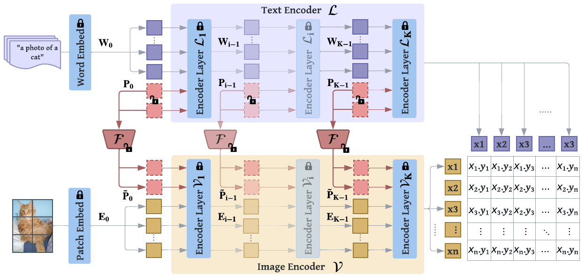
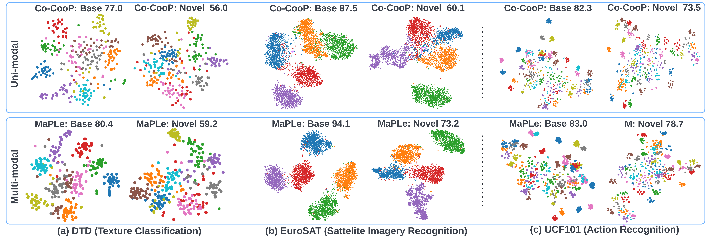

<br>

<p align="center">
<iframe width="560" height="315" src="https://youtu.be/fmULeaqAzfg" title="YouTube video player" frameborder="0" allow="accelerometer; autoplay; clipboard-write; encrypted-media; gyroscope; picture-in-picture" allowfullscreen></iframe>
</p>

<br>


<p align="justify"> <span style="color: blue">(a)</span> Existing methods adopt uni-modal
prompting techniques to fine-tune CLIP representations as prompts are learned only in a single branch of CLIP (language or vision).  <span style="color: blue">(b)</span> We propose <b>M</b>ulti-mod<b>a</b>l <b>P</b>rompt <b>Le</b>arning (MaPLe) which introduces branch-aware hierarchical prompts that adapt both language and vision branches simultaneously for improved generalization. <span style="color: blue">(c)</span> MaPLe surpasses state-of-the-art methods on
11 diverse image recognition datasets for novel class generalization task.
 </p>

 
## Abstract
<p align="justify">
Pre-trained vision-language (V-L) models such as CLIP have shown excellent generalization ability to downstream tasks. However, they are sensitive to the choice of input text prompts and require careful selection of prompt templates to perform well. Inspired by the Natural Language Processing (NLP) literature, recent CLIP adaptation approaches learn prompts as the textual inputs to fine-tune CLIP for downstream tasks. We note that using prompting to adapt representations in a single branch of CLIP (language or vision) is sub-optimal since it does not allow the flexibility to dynamically adjust both representation spaces on a downstream task. In this work, we propose Multi-modal Prompt Learning (MaPLe) for both vision and language branches to improve alignment between the vision and language representations. Our design promotes strong coupling between the vision-language prompts to ensure mutual synergy and discourages learning independent uni-modal solutions. Further, we learn separate prompts across different early stages to progressively model the stage-wise feature relationships to allow rich context learning. We evaluate the effectiveness of our approach on three representative tasks of generalization to novel classes, new target datasets and unseen domain shifts. Compared with the state-of-the-art method Co-CoOp, MaPLe exhibits favorable performance and achieves an absolute gain of 3.45% on novel classes and 2.72% on overall harmonic-mean, averaged over 11 diverse image recognition datasets. </p>

## MaPLe design


<p align="justify">MaPLe tunes both <b>vision</b> and <b>language</b> branches where only the context prompts are learned, while the rest of the model is frozen. MaPLe conditions the vision prompts on language prompts via a V-L coupling function to induce mutual synergy between the two modalities. Our framework uses deep contextual prompting where separate context prompts are learned across multiple transformer blocks.</p>
 
## Prompting CLIP via Vision-Language prompts

<p align="justify"> Table below compares different possible prompting design choices as an ablation for our proposed branch-aware multi-modal prompting, MaPLe. Results reported below show accuracy for base and novel classes which are averaged across 11 recognition datasets over 3 seeds. </p>
<br> 
<center>
<table  border="0">
<tbody>
<tr>
<td><center> <b>Method</b>  </center>   </td>
<td><center> <b>Base Acc.</b>  </center>   </td>
<td><center> <b>Novel Acc.</b>  </center>   </td>
<td><center> <b>Harmonic mean (HM)</b>  </center>   </td>
<td><center> <b>Epochs</b>  </center>   </td>
</tr>
<tr>
  <td>Deep vision prompting</td>
<td>80.24</td>
<td>73.43</td>
<td>76.68</td>
<td>5</td>
</tr>
<tr>
<td>Deep language prompting</td>
<td> 81.72 </td>
<td> 73.81 </td>
<td> 77.56 </td>
<td> 5 </td>
</tr>
<tr>
<td>Independent V-L prompting</td>
<td> 82.15 </td>
<td> 74.07 </td>
<td> 77.90 </td>
<td> 5 </td>
</tr>
<tr>
<td>  <b style="color:black;">  MaPLe (ours) </b></td>
<td> <b style="color:black;"> 82.28 </b> </td>
<td> <b style="color:black;"> 75.14 </b></td>
<td><b style="color:black;"> 78.55 </b></td>
<td><b style="color:black;"> 5 </b></td>
</tr>
</tbody>
</table>
</center>

<br/> 


## MaPLe in comparison with existing methods

<p align="justify">Below table shows comparison of MaPLe with state-of-the-art methods on base-to-novel generalization. MaPLe learns multi-modal prompts and demonstrates strong generalization performance over existing methods on 11 different recognition datasets.</p>
<br> 
<center>
<table  border="0">
<tbody>
<tr>
<td><center> <b>Method</b>  </center>   </td>
<td><center> <b>Base Acc.</b>  </center>   </td>
<td><center> <b>Novel Acc.</b>  </center>   </td>
<td><center> <b>Harmonic mean (HM)</b>  </center>   </td>
<td><center> <b>Epochs</b>  </center>   </td>
</tr>
<tr>
  <td><a href="https://arxiv.org/abs/2103.00020">CLIP</a></td>
<td>69.34</td>
<td>74.22</td>
<td>71.70</td>
<td>-</td>
</tr>
<tr>
<td><a href="https://arxiv.org/abs/2109.01134">CoOp</a></td>
<td> <b style="color:black;"> 82.69</b> </td>
<td> 63.22 </td>
<td> 71.66 </td>
<td> 200 </td>
</tr>
<tr>
<td><a href="https://arxiv.org/abs/2203.05557">CoCoOp</a></td>
<td> 80.47 </td>
<td> 71.69 </td>
<td> 75.83 </td>
<td> 10 </td>
</tr>
<tr>
<td>  <b style="color:black;">  MaPLe (ours) </b></td>
<td> 82.28 </td>
<td> <b style="color:black;"> 75.14 </b></td>
<td><b style="color:black;"> 78.55 </b></td>
<td><b style="color:black;"> 5 </b></td>
</tr>
</tbody>
</table>
</center>

<br/> 

 
## TSNE Visualizations

<p align="justify">t-SNE plots of image embeddings in uni-modal prompting method
Co-CoOp, and MaPLe on 3 diverse image recognition datasets. MaPLe shows better separability in both base and novel classes. </p>




## Effectiveness of MaPLe

<p align="justify">Below figure shows percentage of classes where <b>MaPLe > Co-CoOp</b> for selected datasets in the order of increasing diversity (distribution gap w.r.t CLIP pretraining dataset, ie generic objects). The overall trend indicates that MaPLe is more effective than Co-CoOp as the diversity of the dataset increases. </p>

<center>  </center>


## BibTeX
If you like our work, please consider citing us.
```
@article{khattak2022MaPLe,
    title={MaPLe: Multi-modal Prompt Learning},
    author={khattak, Muhammad Uzair and Rasheed, Hanoona and Maaz, Muhammad and Khan, Salman and Khan, Fahad Shahbaz},
    journal={https://arxiv.org/abs/2210.03117},
    year={2022}
}
```
